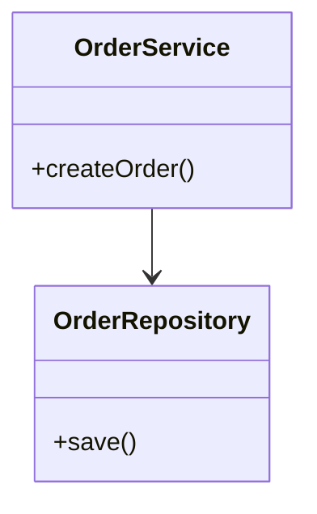
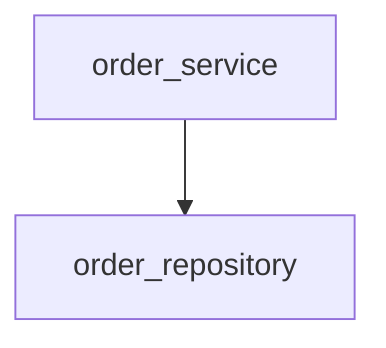
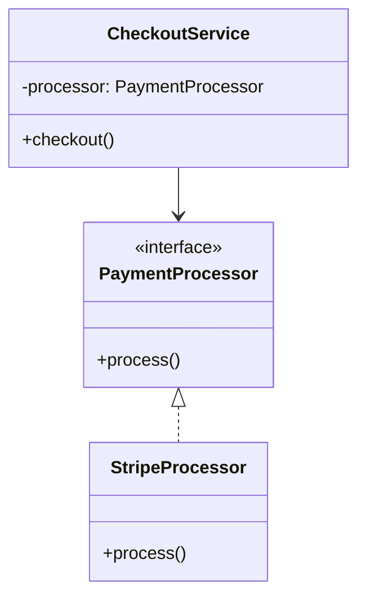
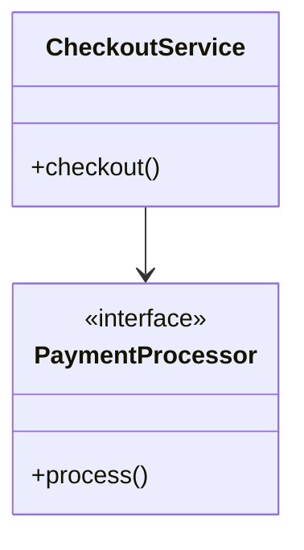

# Rule 1 - Mermaid 類別圖語法

- 類別圖必須使用 Mermaid `classDiagram` 語法。
- 類別圖必須以 `classDiagram` 作為第一行。
- 類別名稱必須使用 PascalCase，且與後續實作的類別名稱一致。
- 類別圖不得使用 Mermaid 不支援或與 `classDiagram` 不相容的 diagram 類型。

## Good Example

- 使用 `classDiagram` 開頭，且類別名稱為 PascalCase。



## Bad Example

- 使用 `flowchart` 而非 `classDiagram`，且類別名稱使用 snake_case。



# Rule 2 - 類別與關係完整性

- 類別圖必須包含本次開發範圍內所有預期新增的類別、介面或模組。
- 類別之間若存在繼承、組合、聚合或依賴關係，必須在圖中以 Mermaid 關係符號標示。
- 關係符號必須使用 Mermaid `classDiagram` 的標準寫法：`<|--` 繼承、`*--` 組合、`o--` 聚合、`-->` 依賴、`<|..` 實作。
- 類別圖不得省略已決定存在的類別或關係。

## Good Example

- 所有相關類別都在圖中，且繼承與依賴關係以標準符號標示。



## Bad Example

- `StripeProcessor` 已決定存在但未出現在圖中，且缺少介面實作關係。



# Rule 3 - 職責簡述

- 每個類別或介面必須在類別圖提案中附上一句職責簡述。
- 職責簡述必須描述該類別的單一主要職責，不得只重複類別名稱。
- 職責簡述應該放在 Mermaid 圖下方的文字說明中，以類別名稱對應列出。
- 職責簡述不得描述與該類別無關的實作細節或方法步驟。

## Good Example

- 每個類別都有一句說明其單一職責的簡述。

```markdown
- **OrderService**：協調下單流程，串接驗證與持久化。
- **OrderRepository**：負責訂單資料的讀寫。
```

## Bad Example

- 簡述只重複類別名稱，且夾帶方法層級的實作步驟。

```markdown
- **OrderService**：OrderService 類別。
- **OrderRepository**：先查詢資料庫再比對欄位後寫入。
```

# Rule 4 - 實作順序

- 實作必須先完成被依賴者，再完成依賴者。
- 實作必須先完成介面或抽象類別，再完成其實作類別。
- 實作必須先完成父類別，再完成子類別。
- 實作不得跳過類別圖中的類別，或在依賴尚未存在時先實作依賴者。

## Good Example

- 先實作 `PaymentProcessor` 介面，再實作 `StripeProcessor`，最後實作依賴前兩者的 `CheckoutService`。

```markdown
1. PaymentProcessor（介面）
2. StripeProcessor（實作 PaymentProcessor）
3. CheckoutService（依賴 PaymentProcessor）
```

## Bad Example

- 在 `PaymentProcessor` 與 `StripeProcessor` 尚未存在時先實作 `CheckoutService`。

```markdown
1. CheckoutService
2. PaymentProcessor
3. StripeProcessor
```

# Rule 5 - 實作對齊類別圖

- 實作結果必須包含類別圖中的每個類別或介面。
- 實作結果中的類別名稱、繼承、實作與依賴關係必須與已確認的類別圖一致。
- 實作結果不得新增類別圖中未出現且未經使用者確認的類別或關係。
- 實作結果不得刪除或改名類別圖中已確認的類別，除非使用者再次確認修改。

## Good Example

- 程式碼中的類別、介面實作與依賴注入方向與已確認類別圖一致。

```typescript
interface PaymentProcessor {
  process(): void;
}

class StripeProcessor implements PaymentProcessor {
  process(): void { /* ... */ }
}

class CheckoutService {
  constructor(private processor: PaymentProcessor) {}
}
```

## Bad Example

- 新增了類別圖中未出現的 `PayPalProcessor`，且 `CheckoutService` 直接依賴具體類別而非介面。

```typescript
class StripeProcessor {
  process(): void { /* ... */ }
}

class PayPalProcessor {
  process(): void { /* ... */ }
}

class CheckoutService {
  constructor(private processor: StripeProcessor) {}
}
```
