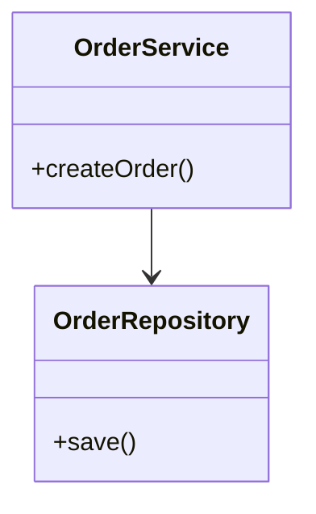
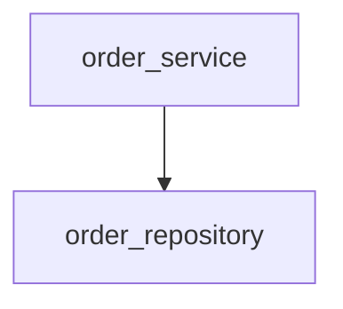
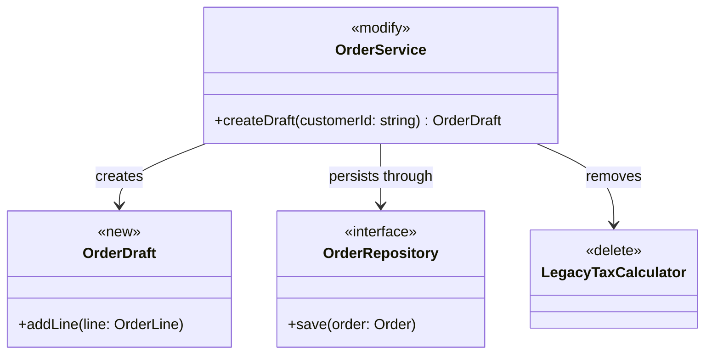
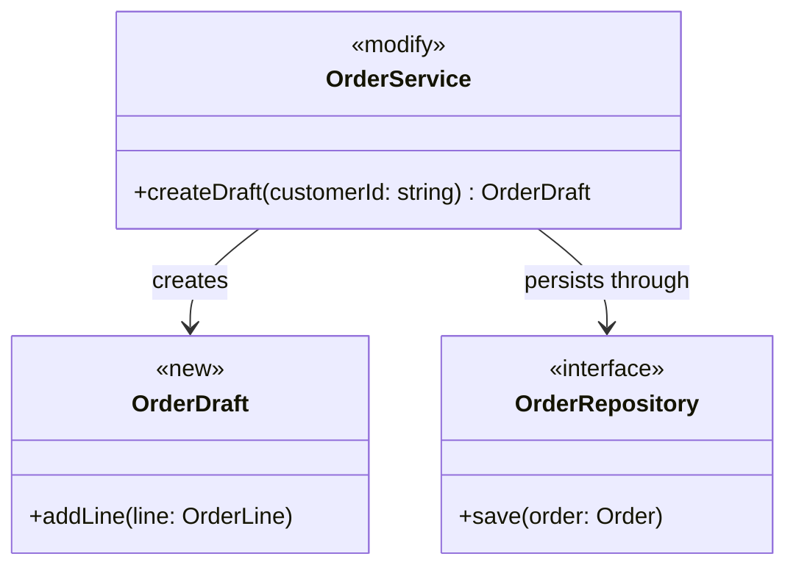
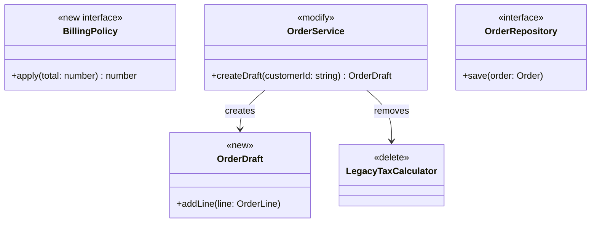
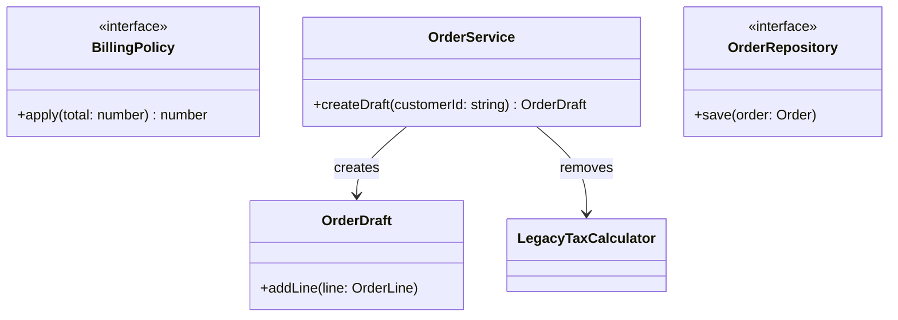

# Rule 1 - Mermaid 類別圖語法

- 類別圖必須使用 Mermaid `classDiagram` 語法。
- 類別圖必須以 `classDiagram` 作為第一行。
- 類別名稱必須使用 PascalCase，且與後續實作的類別名稱一致。
- 類別圖不得使用 Mermaid 不支援或與 `classDiagram` 不相容的 diagram 類型。

## Good Example

- 使用 `classDiagram` 開頭，且類別名稱為 PascalCase。



## Bad Example

- 使用 `flowchart` 而非 `classDiagram`，且類別名稱使用 snake_case。



# Rule 2 - 類別與關係完整性

- 類別圖必須包含本次要新增、修改與刪除的每個類別、介面或模組。
- 類別圖必須包含為表達已決定關係所必需的既有且本次不改的類別。
- 類別之間若存在繼承、組合、聚合或依賴關係，必須在圖中以 Mermaid 關係符號標示。
- 關係符號必須使用 Mermaid `classDiagram` 的標準寫法：`<|--` 繼承、`*--` 組合、`o--` 聚合、`-->` 依賴、`<|..` 實作。
- 類別圖不得省略已決定要新增、修改、刪除，或為表達關係而保留的類別或關係。

## Good Example

- 新增、修改、刪除與為了關係而保留的既有類別都在圖中，依賴與實作關係以標準符號標示。



## Bad Example

- 已決定要刪除的 `LegacyTaxCalculator` 與其關係未出現在圖中。



# Rule 3 - 職責簡述

- 每個類別或介面必須在類別圖提案中附上一句職責簡述。
- 職責簡述必須描述該類別的單一主要職責，不得只重複類別名稱。
- 職責簡述必須放在 Mermaid 圖下方的文字說明中，以類別名稱對應列出。
- 職責條目必須在類別名稱後標明變更種類：新增、修改、刪除或既有不變。
- 職責簡述不得描述與該類別無關的實作細節或方法步驟。

## Good Example

- 每個類別都有一句單一職責，並標明變更種類。

```markdown
- **OrderService**（修改）：協調下單流程，串接驗證與持久化。
- **OrderRepository**（既有不變）：負責訂單資料的讀寫。
```

## Bad Example

- 簡述只重複類別名稱，且夾帶方法層級的實作步驟。

```markdown
- **OrderService**（修改）：OrderService 類別。
- **OrderRepository**（既有不變）：先查詢資料庫再比對欄位後寫入。
```

# Rule 4 - 實作順序

- 實作必須先完成被依賴、且本次要新增或修改的類別，再完成依賴它們的新增或修改。
- 實作必須先完成介面或抽象類別的新增或修改，再完成其實作類別的新增或修改。
- 實作必須先完成父類別的新增或修改，再完成子類別的新增或修改。
- 刪除類別必須排在所有仍參考該類別的新增與修改完成之後。
- 多個類別都要刪除且彼此有依賴時，必須先刪除依賴者，再刪除被依賴者。
- 既有且本次不改的類別不得納入實作順序。
- 實作不得在其依賴的新增或修改尚未完成時，先實作依賴者。

## Good Example

- 先新增 `OrderDraft`，再修改依賴它的 `OrderService`，最後刪除已不再被參考的 `LegacyTaxCalculator`。`OrderRepository` 既有且本次不改，因此不在實作順序中。

```markdown
1. OrderDraft（新增）
2. OrderService（修改，依賴 OrderDraft）
3. LegacyTaxCalculator（刪除）
```

## Bad Example

- 在 `OrderDraft` 尚未新增時先修改 `OrderService`，並把既有且本次不改的 `OrderRepository` 排入實作順序。

```markdown
1. OrderRepository（既有不變）
2. OrderService（修改）
3. OrderDraft（新增）
4. LegacyTaxCalculator（刪除）
```

# Rule 5 - 實作對齊類別圖

- 實作必須建立每個標為新增的類別或介面。
- 實作必須修改每個標為修改的類別，且修改範圍限於類別圖該類別框內列出的屬性、方法，以及指向未刪除類別的關係。
- 實作必須刪除每個標為刪除的類別，並移除指向該類別的關係。
- 實作必須保留每個既有且本次不改的類別，且不得修改其內容。
- 實作完成後，類別名稱、繼承、實作與依賴關係必須與已確認類別圖中、兩端都未被刪除的關係一致。
- 實作結果不得新增類別圖中未出現且未經使用者確認的類別或關係。

## Good Example

- 程式碼新增 `OrderDraft`、只為 `OrderService` 加入圖上列出的方法，並刪除 `LegacyTaxCalculator`。

```typescript
class OrderDraft {
  addLine(line: OrderLine): void { /* ... */ }
}

class OrderService {
  createDraft(customerId: string): OrderDraft { /* ... */ }
  confirm(draft: OrderDraft): Order { /* ... */ }
}
```

## Bad Example

- 未新增圖上的 `OrderDraft`，未刪除 `LegacyTaxCalculator`，並改動了圖上標為既有不變的 `OrderRepository`。

```typescript
class OrderRepository {
  archive(order: Order): void { /* ... */ }
}

class OrderService {
  createDraft(customerId: string): OrderDraft { /* ... */ }
}

class LegacyTaxCalculator {
  calculate(amount: number): number { /* ... */ }
}
```

# Rule 6 - 變更標註

- 每個類別必須只屬於一種變更種類：新增、修改、刪除或既有不變。
- 本次新增的類別必須在類別框使用 stereotype `<<new>>`，並在該類別定義之後加上 `class <類別名稱>:::new`。
- 本次修改的類別必須使用 stereotype `<<modify>>` 與 `class <類別名稱>:::modify`。新增方法、修改既有行為與修改屬性都屬於修改。
- 本次刪除的類別必須使用 stereotype `<<delete>>` 與 `class <類別名稱>:::delete`。
- 刪除類別的框內不得列出屬性或方法。
- 刪除類別，以及它與其他類別的關係，仍必須畫在類別圖上。
- 既有且本次不改的類別不得使用 `<<new>>`、`<<modify>>` 或 `<<delete>>`，也不得套用 `new`、`modify` 或 `delete` 樣式。
- 類別同時是 interface、abstract 或 enumeration 時，必須把變更種類與角色寫在同一個 stereotype，變更種類在前，例如 `<<new interface>>`。
- 既有且本次不改的 interface、abstract 或 enumeration 只標角色，例如 `<<interface>>`。
- 類別圖不得把變更種類與角色拆成兩個 stereotype。
- 修改類別的框內必須只列出本次完成後仍存在、且本次有變更的屬性與方法。
- 類別圖必須包含提案骨架中的 `classDef new`、`classDef modify` 與 `classDef delete`，且這三行必須與骨架逐字相同。
- 類別圖不得另定義變更顏色或改寫上述 `classDef`。

## Good Example

- 新增、修改、刪除各自使用單一 stereotype 與對應樣式；新介面把角色寫在同一個 stereotype；修改類別只列出本次變更的方法；刪除類別沒有成員。



## Bad Example

- 同一組類別沒有變更 stereotype 與對應樣式；新增介面又被拆成兩個 stereotype，變更種類無法與角色一起顯示。


