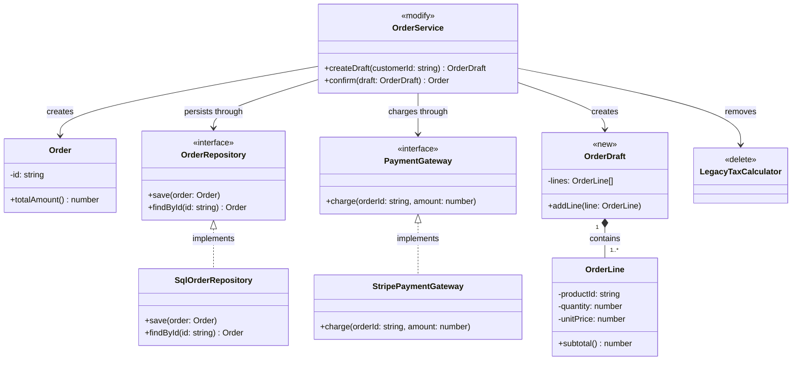

# 類別設計提案

## 設計意圖

- 建立草稿：呼叫 `OrderService.createDraft`。服務建立 `OrderDraft`，以 `OrderDraft.addLine` 納入 `OrderLine`。
- 確認訂單：呼叫 `OrderService.confirm`。服務依 `OrderDraft` 建立 `Order`，呼叫 `PaymentGateway.charge` 依 `Order.totalAmount` 扣款，再呼叫 `OrderRepository.save` 儲存。
- 移除舊稅務：`OrderService` 不再呼叫 `LegacyTaxCalculator`。依賴改完後刪除 `LegacyTaxCalculator`。

## 類別設計

## 類別設計說明

### 類別職責

- **Order**（既有不變）：維護已確認訂單的狀態並計算訂單總額。
- **OrderLine**（既有不變）：表達單一商品的購買數量、單價與小計。
- **OrderDraft**（新增）：在訂單確認前收集訂單明細。
- **OrderRepository**（既有不變）：定義訂單持久化與查詢契約。
- **SqlOrderRepository**（既有不變）：以關聯式資料庫實作訂單持久化契約。
- **PaymentGateway**（既有不變）：定義訂單付款扣款契約。
- **StripePaymentGateway**（既有不變）：透過 Stripe 實作付款扣款契約。
- **OrderService**（修改）：改以草稿建立與確認來協調訂單、付款與持久化。
- **LegacyTaxCalculator**（刪除）：計算訂單稅額。

### 關係說明

- **OrderDraft → OrderLine（組合）**：草稿需求規定明細只能隸屬單一草稿，由 `OrderDraft` 建立及管理，刪除草稿時明細一併刪除。
- **SqlOrderRepository → OrderRepository（介面實作）**：`SqlOrderRepository` 提供 `OrderRepository` 定義的儲存與查詢操作，讓持久化實作可依契約替換。本次不改這兩個類別。
- **StripePaymentGateway → PaymentGateway（介面實作）**：`StripePaymentGateway` 提供 `PaymentGateway` 定義的扣款操作，讓付款供應商可依契約替換。本次不改這兩個類別。
- **OrderService → OrderRepository（依賴）**：確認訂單後需要儲存 `Order`；服務只使用持久化契約，因此依賴穩定抽象而非 SQL 實作。
- **OrderService → PaymentGateway（依賴）**：確認訂單時需要依訂單金額扣款；服務只需要扣款契約，因此不直接耦合 Stripe 實作。
- **OrderService → Order（依賴）**：`confirm` 會建立並回傳 `Order`，但服務不持有其生命週期或所有權。
- **OrderService → OrderDraft（依賴）**：`createDraft` 會建立 `OrderDraft`，`confirm` 只在方法執行期間使用它，服務不擁有草稿的生命週期。
- **OrderService → LegacyTaxCalculator（依賴，本次移除）**：服務目前仍依賴舊稅務類別。本次改完 `OrderService` 後刪除 `LegacyTaxCalculator`，這條依賴一併移除。
