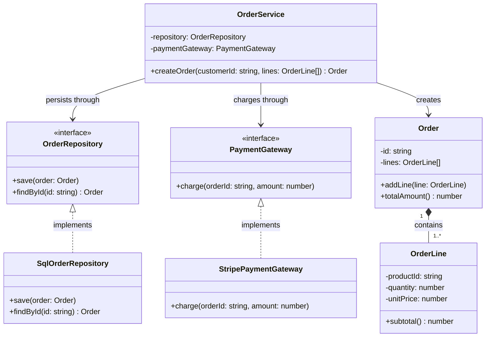

# 類別設計提案

## 設計意圖

- 建立訂單：呼叫 `OrderService.createOrder`。服務建立 `Order`，以 `Order.addLine` 納入 `OrderLine`，呼叫 `PaymentGateway.charge` 依 `Order.totalAmount` 扣款，再呼叫 `OrderRepository.save` 儲存。
- 查詢訂單：呼叫 `OrderRepository.findById` 取得 `Order`，並讀取其中的 `OrderLine`。
- 組裝服務：建立 `OrderService` 時傳入 `SqlOrderRepository` 與 `StripePaymentGateway`。呼叫端之後只使用 `OrderService`、`OrderRepository` 與 `PaymentGateway`，不直接呼叫這兩個實作類別。

## 類別設計

## 類別設計說明

### 類別職責

- **Order**：維護訂單狀態並計算訂單總額。
- **OrderLine**：表達單一商品的購買數量、單價與小計。
- **OrderRepository**：定義訂單持久化與查詢契約。
- **SqlOrderRepository**：以關聯式資料庫實作訂單持久化契約。
- **PaymentGateway**：定義訂單付款扣款契約。
- **StripePaymentGateway**：透過 Stripe 實作付款扣款契約。
- **OrderService**：協調訂單建立、付款與持久化流程。

### 關係說明

- **Order → OrderLine（組合）**：訂單需求規定明細只能隸屬單一訂單，由 `Order` 建立及管理，刪除訂單時明細一併刪除。
- **SqlOrderRepository → OrderRepository（介面實作）**：`SqlOrderRepository` 提供 `OrderRepository` 定義的儲存與查詢操作，讓持久化實作可依契約替換。
- **StripePaymentGateway → PaymentGateway（介面實作）**：`StripePaymentGateway` 提供 `PaymentGateway` 定義的扣款操作，讓付款供應商可依契約替換。
- **OrderService → OrderRepository（依賴）**：下單流程需要儲存訂單；服務只使用持久化契約，因此依賴穩定抽象而非 SQL 實作。
- **OrderService → PaymentGateway（依賴）**：下單需求包含依訂單金額扣款；服務只需要扣款契約，因此不直接耦合 Stripe 實作。
- **OrderService → Order（依賴）**：`createOrder` 會建立並回傳 `Order`，但服務不持有其生命週期或所有權。
